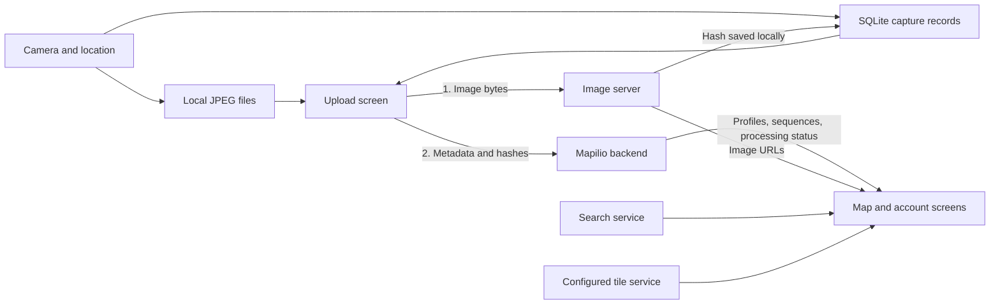

# How the mobile app fits together

Start here before changing capture, upload, or sign-in. This is a map of the
current code, not a proposed rewrite. The [README](../README.md#getting-started)
covers setup; the [roadmap](../ROADMAP.md) separates working source from the
remaining store and physical-device checks.

## The main boundaries

[App.js](../App.js) installs the Redux, navigation, localization and UI providers
and initializes SQLite. [navigator/](../navigator/) connects the screens.
The backend owns accounts, published metadata and downstream processing. Image
storage, anonymization and AI processing are outside this mobile repository;
the phone does not connect directly to a NAS or run the server's AI pipeline.

## Capture, files and upload

The capture entry is [screens/AppCamera.js](../screens/AppCamera.js), with the
Expo camera in [components/Camera.js](../components/Camera.js) and the capture/save
path in [components/AutoActionButton.js](../components/AutoActionButton.js).
Location, orientation and sensor readings feed that path. Images are compressed
as JPEGs and moved to the selected storage root using [util/fs.js](../util/fs.js).

[db.js](../db.js) stores metadata in the SQLite `captures` table, not image bytes:
relative file path, EXIF/location JSON, `group_id`, `sequence_uuid`, capture order,
project/organization information and the original storage choice. A group can
contain multiple sequences. Keep the stored relative path and storage choice
together; changing today's storage preference must not move yesterday's files.

[components/Uploads/Upload.js](../components/Uploads/Upload.js) coordinates upload:

1. Check connectivity and sign-in, confirm cellular use when needed, and keep the
   app awake. Read sequences and their ordered capture rows from SQLite.
2. For each image, [getHash](../helper/upload.js) sends a multipart JPEG to the
   image server's `POST /api/upload/mobile` using `Cdn`. Save the returned hash
   and `uploaded=1` in SQLite. An existing hash skips re-sending the file.
3. `imageryUpload` builds the legacy metadata envelope from those rows and sends
   it through `Api` to `POST /api/function/mapilio/imagery/upload`.
4. After a successful sequence result, the coordinator removes its local files
   and rows through `deleteSequence`. Errors stop the loop; pending rows and
   saved hashes allow another attempt without re-uploading acknowledged files.

`uploaded=1` means the image-server step succeeded, **not** that the backend has
accepted the sequence or finished processing it. Do not delete files at that
intermediate step. A retained legacy rule also discards sequences shorter than
five images in `imageryUpload`; account for that when testing cleanup.

Pause/resume waits between files and before metadata submission. Stop cancels
the active Axios requests. Transport retries are bounded: `Api` retries 502s;
`Cdn` also retries timeouts. Both attempt token refresh after a 401. There is no
registered native background upload worker or durable OS job scheduler here.
Uploads run in the active app's JS loop; returning to the app and starting upload
again is not the same as guaranteed upload after suspension or termination.

## API clients

The implementations live in [util/helpers/api/](../util/helpers/api/).

| Client      | Destination and use                                                                              | Authentication and response                                                                                                                     |
| ----------- | ------------------------------------------------------------------------------------------------ | ----------------------------------------------------------------------------------------------------------------------------------------------- |
| `Api`       | `EXPO_PUBLIC_SERVICE_URL`: Mapilio API reads and signed-in operations, including metadata upload | Adds the current bearer token when present; refreshes on 401. Returns the response body. Whether login is required is decided by each endpoint. |
| `PublicApi` | Same service URL: password/social login, registration, password reset and refresh                | No automatic bearer header or refresh interceptor. A call may supply an explicit header, as logout does. Returns the response body.             |
| `Search`    | `EXPO_PUBLIC_SEARCH_API`: place search and reverse geocoding                                     | No Mapilio bearer header or refresh. Returns the Axios response, so callers read `.data`.                                                       |
| `Cdn`       | `EXPO_PUBLIC_CDN_URL`: image bytes and upload acknowledgments                                    | Adds the signed-in bearer token and supports refresh/retry. Returns the response body. Ordinary displayed images use image URLs instead.        |

[MobileAccountApi.js](../util/helpers/api/MobileAccountApi.js) is a small account
operation wrapper over `Api` and `PublicApi`, not a fifth transport. Its shared
paths are in [MobileAccountPaths.js](../util/helpers/api/MobileAccountPaths.js).
Account deletion disables automatic retries. MapLibre tile URLs and source-layer
IDs are configured separately in [config/tileConfig.js](../config/tileConfig.js).

## State and persistence

[store/combineReducer.js](../store/combineReducer.js) lists the state owners:

| Reducer              | Owns                                                                                |
| -------------------- | ----------------------------------------------------------------------------------- |
| `getTokenReducer`    | Auth tokens, signed-in user, login status and session generation                    |
| `cameraReducer`      | Camera reference, capture state, GPS/orientation and capture warnings               |
| `imagesReducer`      | Selected images and current sequence selection                                      |
| `settingsReducer`    | Capture spacing, resolution, selected project and storage preference                |
| `uploadReducer`      | Upload list and UI progress/selection                                               |
| `generalReducer`     | Connectivity, language/theme, current position, onboarding and remote configuration |
| `leaderboardReducer` | User/organization rankings and challenge results                                    |
| `marketplaceReducer` | Marketplace map position and task data                                              |
| `searchReducer`      | Search history, results and request state                                           |
| `tooltipReducer`     | Walkthrough and tooltip state                                                       |

[store/store.js](../store/store.js) uses Redux-Persist with AsyncStorage. It
excludes `cameraReducer`, `imagesReducer` and `marketplaceReducer`; the other
slices, including auth, are persisted. This is the current implementation, not
encrypted credential storage. Never print persisted state or tokens in bug
reports. UI state in AsyncStorage does not replace capture rows in SQLite, and
neither contains the JPEG bytes. Rebuild upload lists from SQLite after restart.

## Why there is a native storage module

[modules/mapilio-storage/](../modules/mapilio-storage/) is a small local Android
Expo module. Kotlin queries Android's app-specific external directories and
checks whether a volume is removable, mounted and writable. A second external
directory is not automatically an SD card. This native platform information is
why the module exists; file reads, moves and deletes still use `util/fs.js`.

The removable-storage helper returns `null` on iOS, when the native module is
absent, or when the card cannot be used. Preserve that failure behavior. Falling
back to internal storage for a row recorded as external could read or delete the
wrong file. Physical card removal/reinsertion remains a device check in
[#104](https://github.com/mapilio/mobile-apps/issues/104), not something an iPhone
simulator proves.

## Sign-in and account changes

- Password sign-in starts in [helper/user.js](../helper/user.js) and posts to
  `/api/v1/mobile/auth/public-token`. It stores the token response and then loads
  the profile. [RefreshToken.js](../util/helpers/api/RefreshToken.js) uses that
  route with a refresh grant; it rejects late results from an older session.
- [components/SocialLogin/](../components/SocialLogin/) contains the provider UI:
  Google and OSM use Expo AuthSession, Apple uses Expo Apple Authentication, and
  Facebook uses `react-native-fbsdk-next`. Facebook iOS Limited Login supplies an
  authentication token, not a Graph API access token.
- [SocialAuth.js](../util/helpers/api/SocialAuth.js) exchanges the provider token
  at `/api/v1/mobile/auth/social-token`. Provider verification and server secrets
  belong in the [backend](https://github.com/mapilio/backend). The app's public
  configuration must not contain confidential OAuth client secrets.
- [screens/Profile/DeleteAccount.js](../screens/Profile/DeleteAccount.js) uses
  provider-specific deletion, including fresh Google authorization. Cancellation
  or provider failure must not fall through to generic account deletion. Code
  is merged, but deployment and disposable-account checks remain in
  [#164](https://github.com/mapilio/mobile-apps/issues/164).

## Before changing a shared path

- Keep published endpoint names, payloads, image hashes and sequence/group IDs
  compatible with installed clients. Coordinate new contracts with the backend;
  an image-server acknowledgment is a separate boundary from metadata acceptance.
- Use [`.env.example`](../.env.example) and isolated test services. Login, upload,
  reports and deletion can write real data; never use production to create test
  imagery or test destructive actions.
- Keep native changes reviewable. Do not run `expo prebuild --clean` over the
  committed iOS/Android projects. `resolver/` contains a legacy compatibility
  shim, not API routing; check its callsites before changing or removing it.
- Run `npm run test:ci -- --runInBand` and `npx tsc --noEmit`. Useful focused
  suites are [upload](../__tests__/helper/upload.test.js),
  [SQLite](../__tests__/db.test.js), [filesystem](../__tests__/util/fs.test.js),
  [authenticated API](../__tests__/helper/authenticatedApi.test.js) and
  [account API](../__tests__/helper/mobileAccountApi.test.js).
- After auth, API, capture or upload changes, replay the affected path against
  the modern backend in the simulator and record both commits and the API
  environment. Real camera/GPS, provider revocation, background behavior, Android
  storage and signed-store artifacts still need their corresponding device or
  service checks. Keep those results in the [roadmap](../ROADMAP.md), not implied
  by a passing unit test.
